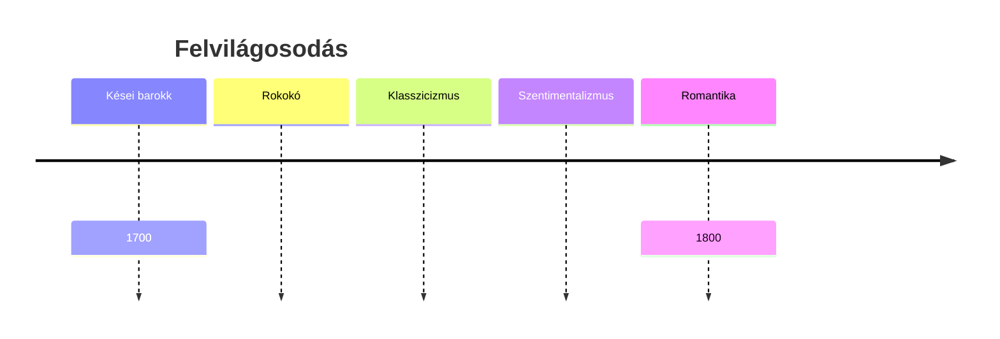

Az ész diadala

- bizalom az észben
- az emberiség haladásának alapja: tudás
- rádió: kizárja a vak hitet, babonát, misztikumot
- tudományos alapokra helyez minden ismeretet --> ezért jut el odáig, hogy megkérdőjelezi az aktuális társadalmi hatalmi rendszerek felépítését (3 hatalmi ág, törvényhozó, végrehajtói, bírói)

Racionalizmus: 
- bölcsője: francia klasszicizmus
- mindent valamilyen mechanizmus mozgat --> feladatunk: ezt megismerni és megfejteni
- gondolkodás: rendet teremteni a káoszban, zűrzavarban
- Descartes --> folyamatos kételkedés
- az érzékeink becsapnak minket
- Angol filozófusok: John Locke, David Hume
- ellenkezőjét állítja a racionalizmusról
- tapasztalat útján
- kutatás módszertan
- emlékezet működése
- képzelet erő

Sapere audé! (jelentése: Merj tudni), felvilágosodás jelmondata

- Immanuel Kant: a két elméletet egyesíti (vagy, vagy) (Tiszta ész kritikája --> műve)
- megismerés alapja = tapasztalat + tudat aktív rendező tevékenysége
- a felvilágosodás az ember kiábrázolása maga okozza kiskorúságból

Montesquieu --> hatalmi ágak elkülönítése
Rousseau --> népfelség elve

A felvilágosodás istenfelfogásai:

- legelterjedtebb: deizmus (Hisznek, hogy Isten teremtette a világot, de további beavatkozás nem történt pl. fejlődés)
- teizmus (Isten benned van, minden hívő önmagában találja meg, lelkiismeret)
- panteizmus (Isten feloldódik a világban, mindenhol jelen van)
- ateizmus (Isten létének a tagadása)

Francia Enciklopédia: 
- természettudományok --> biológia, kémia, fizika
- mesterségek
- művészetek --> divat
- nyelvek
- információk összegyűjtése
- részletek, pontos

**Angol felvilágosodás**

1.) Daniel Defoe: Robin Crusoe
- kalandregény: utaztatás motívuma --> jellemváltozás
- robinzonád (kalandregény egyik változata)
- részletes ábrázolás --> hitelesség látszatát kelti pl. naplóbejegyzések
- főhőse üzletember, egyik útja során hajótörést szenved
- 28 évre egy "lakatlan" szigetre kényszerül: ahol megteremti a saját civilizációját
- magára utalt ember életre: küzdelem az életben maradásért
- Péntek: természetétől adódóan jószándékú

2.) Jonathan Swift: Gulliver utazásai (1726)
- szatíra: a komikus ábrázolás egyik válfaja, jóval élesebb, elutasítóbb a humornál, legfőbb eszközei gúny (lírai műfaj, kicsinyítés, nagyítás, túlzás)
- szatirikusan áll hozzá: 
	- korához
	- felvilágosodás eszméihez
	- társadalmi rendszerhez
	- emberi természethez

- 4 utazás 4 világ

| Törpék                                        | Óriások                          | Tudósok                                   | Nyihahák                                                      |
| --------------------------------------------- | -------------------------------- | ----------------------------------------- | ------------------------------------------------------------- |
| Piti ügyek miatt való marakodás, kicsinyesség | az élet durvaságra, ostrombasága | tudományos megszállottság --> görbe tükör | utópia -> ideális világ amely a valóságban nem megvalósítható |

Főhős tragédiája: nem tud visszailleszkedni a saját társadalmába
- a világokba tett látogatások során kiábrándító tapasztalatokat gyűjt
- célja: az olvasót elgondolkodtatni, "felrázza" --> kizökkenti

Esetleg ha olvasni akarsz:

[D. D.: Robin Crusoe](https://mek.oszk.hu/10300/10389/10389.htm) (szerintem elég unalmas, elég csak a részeket megnézni, kb. a vázlat összefoglalja a lényeget)

[J. S.: Gulliver utazásai]( https://mek.oszk.hu/08300/08351/08351.htm) (12 fejezetes)

