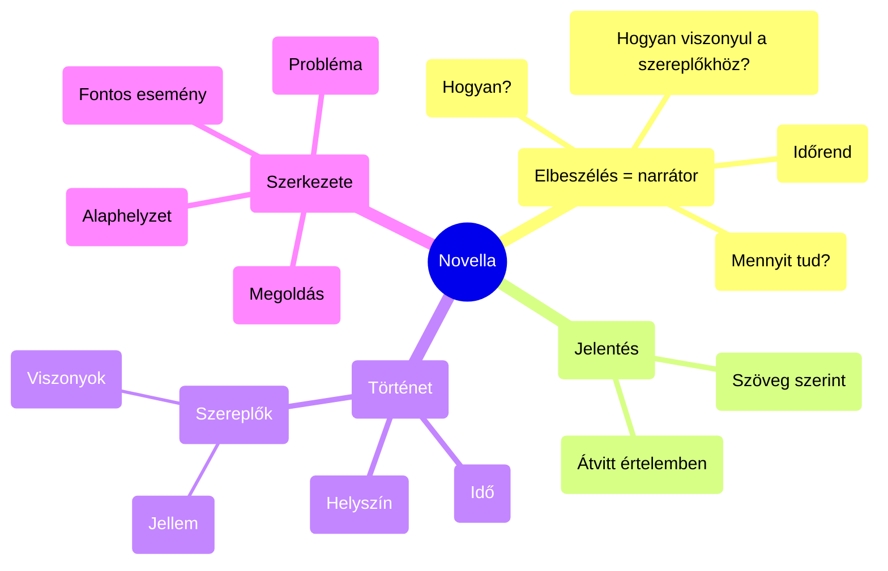

### A szórakoztató rövid történetek megteremtője

- **NOVELLA műfaja**
- ,,Újdonságot" jelent (érdekes hír, különös történet)
- Mai értelemben: kisepikai műfaj
- Tömören előadott történet
	- Viszonylag szűkre szabott térben és időben
	- Kevés szereplőt mozgat
	- Többnyire sorsdöntő fordulatra épül → meglepés
- Számára az a fontos, hogy a külső világ sokszínűségére mutasson rá
- Megragadja a különös helyzeteket, furcsa karakterekkel dolgozik

### Dekameron
- Novellagyűjtemény, jelentése 10 nap
- 100 db történetet tartalmaz
- Szerelmi erotikus, ironikus - szatirikus → Saját erkölcsi világ
- Mentes a kötöttségtől, humorista írói világkép
- A földi élet örömteli és ésszerű kihasználása
- Városi polgári környezet
- Hősei nehéz helyzetből szabadulnak meg egy-egy találó, tréfás ötlettel
- Cél: tanítás és szórakoztatás

