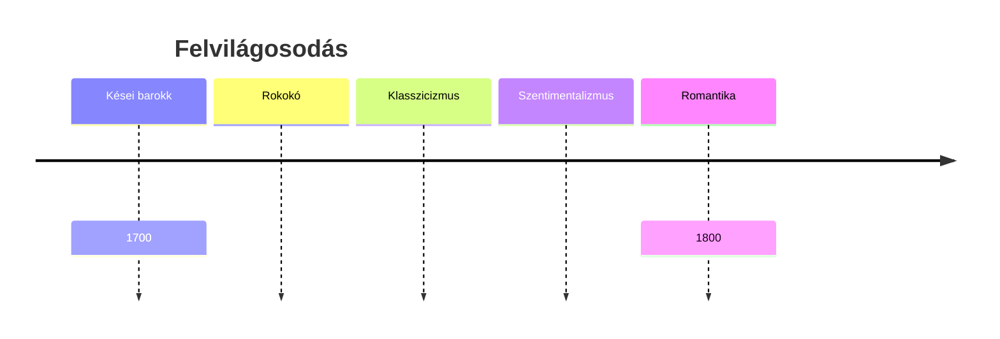
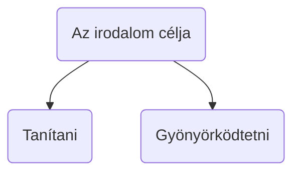

### Rokokó

- túldíszítettség

### Klasszicizmus

- classic = osztály
- legjobb osztályba tartozó
- örök érvényű harmonikus alkotások keresése
- antikvitás: görög-római minták → imitáció
- szabályok és normák → szerkezet, forma
- mértéktartás, észszerűség

- kedvelt műfajok: eposz, tragédia, óda, epigramma, tanmese, szatíra
- drámában kiemelt szerepe van a hármas egység betartása

### Szentimentalizmus

- érzelemközpontúság
- természet kultusz
