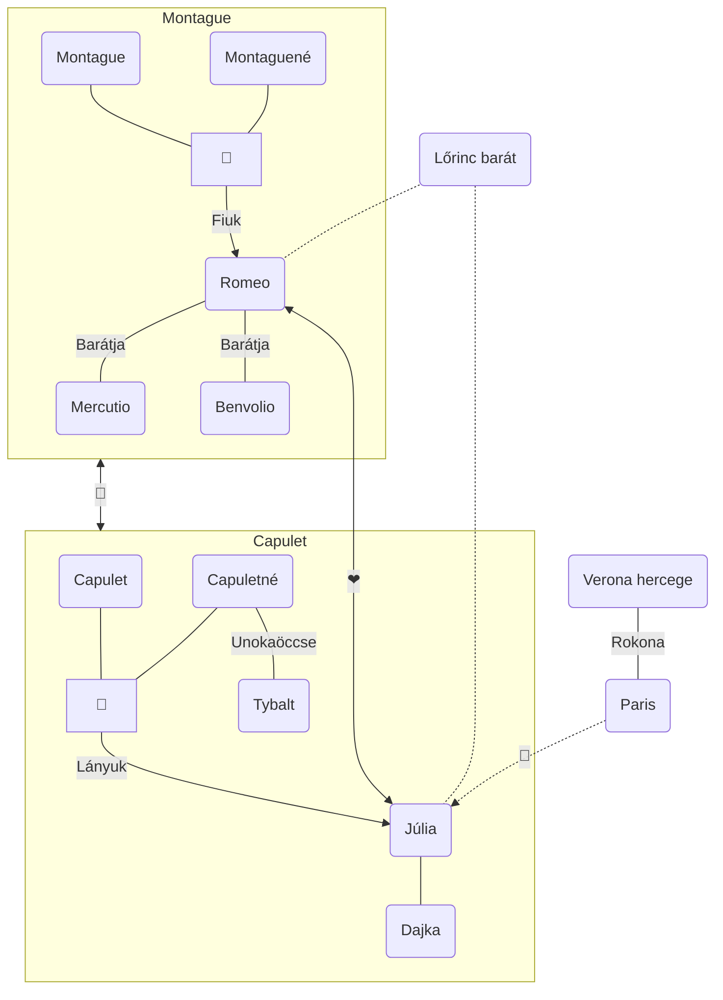

# William Shakespeare (1564-1616)

- az angol reneszánsz drámaírás nagy alakja volt
- Stratford-upon-Avon Angliai városban született.
- 18 évesen megnősült (8 évvel idősebb nőt vett el)
- Anne Hathaway volt a felesége
- később elhagyta a családját, és Londonba ment, ahol bekapcsolódott a színházi életbe, mint színész, drámaíró, és mint Globe színház fő részvényese, amiből meggazdagodott (1585-1586) 
- később visszaköltözött szülővárosába, 1616-ban halt meg 
- Művei: 3 pálya korszakát különböztetjük meg 
	- **1590-1600:** Ekkor írta a Rómeó és Júlia című tragédiáját, Ahogy tetszik című komédiáját
	- **1601-1613:** Ekkor írta a legjobb műveit ilyen pl.: Hamlet, Othello
	- **1614-1616:** Színműveket írt, amelyben tragikus a kezdet, de pozitív a vége Pl.: Vihar

# A reneszánsz színház

- kívülről 8 szögletű, belülről pedig kör alakú felülnyitott épület 
- csak nappal, természetes fényben játszottak
- nevét a Globus-ról (földgömb), mert a tetején volt egy díszítőelem
- többnyire fából készült
- több szintes volt az épület
- belseje: 
	- 3-as tagolású
	- az előszínpad benyúlt a közönség sorai közé, itt játszották a sokszereplős jeleneteket pl.: párbajok
	- hátsószínpad itt a zárt térben játszódó jeleneteket adták elő pl.: kripta jelenet
	- felső színpad pl.: erkélyjelenet
	- a színpad és a közönség között még nem volt függöny 
	- nem voltak díszletek így a helyszínről és az időről a szövegből értesülhettek a nézők
- a női szerepeket is férfiak játszották
- nem voltak felvonások, így szünetek sem
- az író műveiben a felvonásokat az utókor alakította ki
- a közönség igényelte, hogy a tragédiában is legyen vicc, illetve hogy a komédiában is legyen szomorúság pl.: Dajka, Mercutió

# Rómeó és Júlia

- 1596-ban írta az első pályakorszakában 
- műfaja: tragédia (a dráma műnembe tartozó műfaj a főszereplők halálával és az általuk képviselt értékek elvesztésével ér véget) 
- témája: a szerelem 
- cím: a főszereplők neve
- helyszín: Verona (Itáliai város)
- az idő az író saját kora néhány nap alatt
- mű stílusa: reneszánsz, egyik legfőbb emberi érzés a szerelem
- írói közlésmód: hiába tragédia, van benne humor is pl.: a dajka
- mondanivaló: a szerelem nagyon fontos érték.
### Szerkezete: 5 felvonásra osztotta fel az utókor 

- **expozíció**: 
	- 1\. felvonás: A két család Montague <—> Capulet család szolgái összeverekednek, Tybald, Júlia unokatestvére beleköt Bembólióba, aki pedig Rómeó unokatestvére, majd a veszekednek. A családfők is bekapcsolódnak, Verona hercege már nagyon unja ezt a vitát, amiről a szereplők sem tudják miből indult, és azt mondja, hogy az életével fizet, aki folytatja. Kiderül, hogy Rómeó reménytelenül szerelmes egy Rosa nevű lányba, Bembólió vigasztalja, mert szomorú, és hívja, hogy menjenek el a Capuleték báljára. Paris herceg szerelmes Júliába, és megkéri a kezét az apjától, szerinte Júlia jól járt volna a herceggel.
- **bonyodalom**: Rómeó és Júlia egymásba szeretnek a bálban, és megtudják, hogy családjaik egymás ellenségei.
- **kibontakozás**: 
	- 1. felvonás: Itt található az erkély jelenet, amikor a fiatalok szerelmet vallanak egymásnak. Másnap Rómeó Júlia dajkájával üzen a lánynak, hogy délután Lőrincz barát a szerzetes pap összeadja őket, és összeházasodnak azt remélve, hogy ez majd kibékíti a szülőket. 
	- 2. felvonás: Tybalt beleköt Rómeóba, Mercutió kihívja Tybaltot párbajra, Tybalt megöli Mercutiót, és ezért bosszúból Rómeó megöli Tybaltot, ezért Verona hercege száműzi Rómeót a városból. Rómeó együtt tölti az éjszakát a feleségével (Nászéjszaka), majd Rómeó Mantovába szökik. A szülők nem tudnak a házasságról, és Paris feleségül akarja venni Júliát. 
	- 4. felvonás: Júlia Lőrincz baráttól növényi szert kap, amely 42 órára tetszhalált okoz, a terv az volt, hogy Rómeó majd titokban visszajön és magával viszi. 
	- 5. felvonás: Azonban a pestis járvány miatt a pap üzenete nem jut el Rómeóhoz, csak olyan álhíreket hall, hogy Júlia meghalt ezért egy patikusnál gyorsan ölő mérget vásárol, és visszatér, majd kimegy a temetőbe, ott önvédelemből leszúrja Parist, akiről azt hitte, hogy sírrabló.
- **tetőpont**: „A fiatalok halála” Rómeó Júliát látva megissza a mérget, és meghal, Júlia ezután tér magához, és látva a halott Rómeót, annak tőrével szíven szúrja magát. Lőrincz barát késve érkezett.
- **megoldás**: Hogy a családok kibékülnek egymással, de ezért nagy árat fizetnek.

### Szereplők jellemzése

##### Rómeó

- kb. 18 éves
- jelleme nem változik, ugyanaz a kamasz marad végig

##### Júlia

- kb. 14-15 éves
- az események hatására felnőtté válik

> Számukra a szerelem a legfontosabb érték, ezért szinte az egész világgal szembe kerülnek. A szülők nem akarnak rosszat a gyereküknek, de ők még a középkori felfogást képviselik, és ezzel áll ellentétben a fiatalok újfajta életszemlélete.

##### Lőrincz barát

- Egyértelműen a fiatalok oldalán áll, és segíti őket mindenben.

##### Júlia dajkája

- Neki kettős a szerepe, egyrészt segíti is a fiatalokat, másrészt ő pártolja a Parissal kötendő házasságot is.

[Holnap Témazáró - Rómeó és Júlia](https://www.youtube.com/watch?v=k5m7dGLF3z8)
