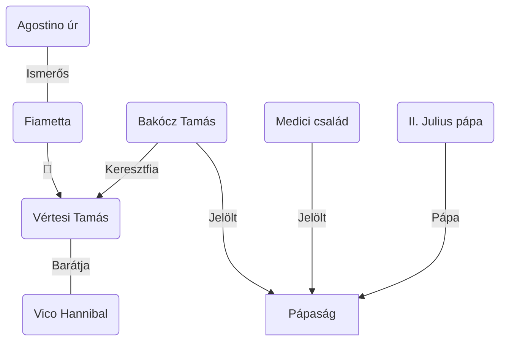

# Pályája

- Herczeg Ferenc regények és novellák elismert írója volt
- 1892 első novellakötetét kiadták: Mutamur —> ezzel futott be a köztudatba
- Olvasói elismerés: Gyurkovics-lányok 1893
- 1894 Új idők (szépirodalmi, művészeti és társadalmi hetilap) lapot megalapította —> 1949-ig volt jelen
- Parlamenti képviselő (Osztrák-Magyar monarchiát fenn kell tartani) —> nemzeti eszme —> történelmi regények, drámák pl: Pogányok (1902), A hét sváb (1916)
- 1919 Az élet kapuja történelmi regények csúcspontja

# Az élet kapuja

> [!INFO] II. Julius = II. Gyula

- A műre hatással volt Herczeg Ferenc írói érzékenysége és politikai éleslátása
	—> mohácsi katasztrófa előtti Magyarország történelmi allegóriája a Trianon előtti Magyarországnak
- 2 cselekményszál bontakozik ki benne közben összefonódva
	- Nagypolitikai szál: Bakócz küzdelme a vatikáni hatalmasokkal
		—>Magyarország megmentéséért
	- Szerelmi történeti szál: Vértesi Tamás + Fiametta szerelme
- Ezzel a 2 szállal akarja éreztetni a valószínűségét a történetnek pl: ismert történelmi alakok: Bakócz Tamás, II. Julius pápa + Helyi színezet is a történelmi hűséget illusztrálja: Bakócz fényűző bevonulása Rómába, amivel meg akarta győzni a római népet hatalmáról és gazdagságáról + veszteségmotívum: II. Gyula politikai cselszövése
- Szerelmi szál fiktív történet —> megvilágítja a Vatikán cselszövését, hatalmi játszmáit és korruptságát
- Idős bankár: Chigi palota fenntartva Fiamettának —> itt történnek a cselszövések és tervelések, mozgatói: II. Julius, bankár Chigi, kétkulacsos Cardulo, apostoli nótárius
- Herczeg történelmi regényének sajátossága: a történelem nem csak keretet ad a fiktív történetnek, hanem a mű központi témája is
- Bakócz küzdelme heroikus (hősies), DE nem jut át az élet kapuján —> a halál birodalma egy nemzet pusztulását jelentheti
- Allegóriaélet felerősíti a narrátor nyelvhasználata amely nem archaizáló, hanem 20. századi nyelven meséli

### Drámai szerkesztés

- Drámaiság —> epikus mű drámai elemeket ötvöz
- Elemei: konfliktusrendszer, cselekményépítés, saját időkezelés, narrátor előadásmódja

### A mű konfliktusrendszere

- Bonyolult konfliktusrendszer —> kapu szimbólum köré épül
- Élet-halál kapuja mást jelent minden szereplő számára
- Bakócz - II. Julius ellentét
	- Bakócz: nemzetért küzd —> a kereszténység védelméért és a nép pusztulásának megakadályozásáért —> számára a kapu a hűséget és árulást jelenti
	- II. Julius: barbár és civilizált világ jelképes ellentéte —> élet és halál találkozása —> számára az élet az építés folytatása, a műalkotások és Róma hatalmának megerősítése, a halál pedig a törökellenes liga létrehozása ami elvenné a pénzt előlük —> ezért csukja be Vatikán kapuját Bakócz előtt —> ő is haldoklik és ezért akarja megmenteni a művészetet, hogy a saját halálát ezzel túlélje és békére lelhessen
- Vértesi Tamás: számára a kapu a Szent Péter-bazilika ajtaja és a Sciarra-palota (Fiametta lakhelye) a boldog szerelem elérésének lehetősége —> Fiametta árulása után számára mindkét ajtó bezárul, Tamás is árulást követ el ahogy átadja Bakócz titkosírással írt listáját naívan Fiamettának
- Fiametta: áruló, mint áldozat, saját magát emészti fel a színjátéka, amit Chigi irányításával Játszott. Tamás visszautasítja Fiametta szépségét, de később megtudja, hogy nem akarta megalázni Tamás - vissza akarja szerezni Tamást, de már késő, ő a kapuhoz a démoni nő megbocsáthatatlan árulásával jut el (,,Meghalni szeretnék! — mondja a leány.")

### Jelentős cselekményszervezés

- a mű gyors jelenetváltásokból áll —> sűríti a művet —> színházi előadás érzetet kelt
- nyitójelenet: európai államok politikai erőviszonyai, Magyarország helyzete a törökellenes küzdelmekben, Bakócz politikai befolyását és fényes bevonulását. Sejthető a végkifejlet, amikor a pápa kimondja, hogy mindent meg fog tenni, hogy ne Bakócz kerüljön a trónra —> nemigazán kerülhető ez el
- a politikai jelenetek keretet adnak a szerelmi történetnek (mágikus látomás a zöld ruhás angyalról, a magyar lovag és a kurtizán találkozása a Sciarra-palotában)
- nagypolitikai szál ok-okozati rendjét oldja a szerelmi szál detektívregényeket idéző titokzatossága
- a két szál folyamatosan összefonódik pl: Chigi-villa lakomajelenete

### A mű időkezelése

- drámai sűrítés, néhány nap vagy hét telik el —> valójában 2 év telik el Bakócz 1512-es januári bevonulása és 1513-as novemberi elhagyása —> ettől is lesz olyan sűrű a cselekmény is, hiszen mindent beletömörít abba a pár napba

### A narrátori beszéd

- romantikai és realista stílusjegyeket is tartalmaz az előadásmódja:
	- romantikus: helyi színezet (Bakócz bevonulása, Chigi-villában a pápaválasztás ünneplése), váratlan szerelmi fordulatok (Vico Hannibal és Fiametta eltervezett látomása" a zöld ruhás angyalról
	- realista: nyelvi tömörség, tárgyilagos —> a politikai szál szereplőitől távolságot tartva mutatja be hogyan jut el Magyarország az élet kapujából a halál kapujába

### Jellemek és értékrendek

- nagypolitikai cselekményszál szereplői —> a történelemből fennmaradt jellemvonásokat nem változtatja meg
- az elbeszélő a szereplőket egymással röviden mutattatja be pl.: Bakóczról Cardulo kardinális ad jellemrajzot
- Bakócz serege kivonul —> végtagjait vesztett Herkules-torzót látnak meg —> magyar sors metaforájaként alkot szerepet a műben
- Bakócz: nemzetéért küzd, mindent megtesz érte (még képes lefizetni a kardinálisokat is), törekszik egy szövetség kialakításáért
- II. Julius: ravasz és ügyes nagypolitikus, Róma és a saját értékeit képviseli, mindent megtesz azért, hogy ne Bakócz kerüljön trónra —> korrupt, nem érdekli a kereszténység sorsa
- Medici: a természetet tökéletlennek tartja, a természet szerinte a művészetben tökéletesedik ki
- Lionardo: számára maga a természet, és így az emberi koponya is maga a tökéletesség, semmit nem akarna változtatni rajta

[Holnap Témazáró - Az élet kapuja](https://www.youtube.com/watch?v=jm5lKoHE1sQ)
