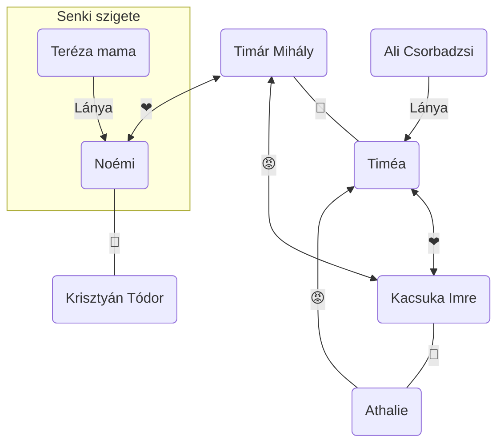

# Pályája

> A magyar olvasóközönség megteremtője
- a legolvasottabb regényeket írta a 19. században
- műveinek szellemét a *liberalizmus* és az *optimizmus* hatja át:
	- liberalizmus: szabadelvűség, az egyén szabadságát hirdeti, elveti a zsarnokságot, és a társadalmi egyenlőség megteremtését tartja fontosnak
		Jókai eszményképe: a polgári Magyarország
	- optimizmus: Jókai a jó, tevékeny akarat diadalában hisz, ezért történetei vigasztalóan hatnak —> derűlátó szemléletmód, erőt és önbizalmat próbál adni nemzetének
- írásművészete, írói stílusa
	- **romantikus** vonások fedezhető fel írói stílusában
	- a hétköznapi eseményekbe **fantáziát**, **misztikumot** rejt el
	- szövegei **líraiak**, **költőiek**
	- világképe alapján a **jóság**nak és az **igazság**nak győzedelmeskednie kell, hogy létrejöjjön egy olyan környezet, ahol a megértés és a bensőséges otthoni légkör uralkodik
	- **elbeszélő technikája (narráció)** is a romantika eszköztárából merít
		- kalandos/fordulatos cselekmény
		- szélsőséges/végletes jellemek
		- kiélezett élethelyzetek (a döntéshozatal pillanatai)
		- hatásra törő jelenetek
		- részletező leírások
	- időben előrehaladó: lineáris szerkesztésmód
	- történetei a múlthoz kapcsolódnak
		- török kor, a török hódoltság időszaka (16. sz.)
		- nosztalgia a közelmúlt iránt (19. sz. eleje): a magyar nemzetfelemelkedéséért vívott, heroikus küzdelem időszaka
	- regényeinek típusa:
		- kalandregények
		- heroikus r.
		- anekdotikus r.
		- **vallomásos** r.: **Az arany ember**
			- főhőse vívódó lélek, akinek a belső lelki folyamatait követjük nyomon (pl. Timár Mihályt kötelességei, polgári élete Komáromhoz kötik, de boldogsága és a harmónia iránti vágya a Senki szigetéhez)

# Az arany ember (1872)

- mitikus szemléletmód: a természet kultusza, mitológiai utalások, a Hold motívuma, a Senki szigete: utópia megteremtése, női archetípusok

### Vaskapu nyitány

- a romantika két gyakori képe: a hegyvonulat (látható magasság) és a folyam (láthatatlan mélység)
- azt az érzetet kelti, hogy az ember által befolyásolhatatlan természeti erők mozgatják a szereplők sorsát
- csodálatra méltó, de egyben rémisztő is: *„emberlakta paradicsom”* és *„félelmetes végállapot”*

### Mitológia

- a főszereplő, Timár Mihály jelleme 3 ókori mitológiai szereplővel hozható párhuzamba
	- Midasz király: Dionüszosz teljesíti azon kívánságát, miszerint amihez hozzáér, az arannyá változik ( azonban ez a képessége akadályozza az evésben, ivásban, ezért megbánja, amit kívánt)
	- Polükratész: a szerencse áldozata (fél a szerencséjétől, mert az istenek irigyek rá emiatt, de az engesztelésül vízbe dobott drága aranygyűrűje is visszakerül hozzá, végzete elkerülhetetlen: keresztre feszítik)
	- Adónisz: Aphrodité és Perszephoné szeretője, az év ⅓ részét Aphroditéval tölti, a másik részét az alvilágban Perszephonével

### A Hold

- a változás jelképe: szinkronban/párhuzamban van Timár belső lelki világával, tulajdonképpen annak a megtestesülése
- szerencse hírnöke (pl. amikor Timár rátalál a kincsre), sőt egyben bűnre csábítja a főszereplőt
- lelkiismeret-furdalást keltő
- halálba hívó, félelmetes kísértő

### A Senki szigete 

- lakói: Teréza mama és lánya, Noémi
- nem tartozik egyik országhoz sem, tehát nem az állam és a társadalom uralkodik ezen a helyen, hanem természet törvényei
- Teréza mama Jókai életfilozófiájának képviselője: örömét leli a kertben és természetben, mindene a családja (Noémi), nem kér senkitől semmit, mindenkin segít
- Noémi: a környezete (maga a természet) formálja tiszta szívű, becsületes, őszinte teremtéssé (Rousseaui gondolat megtestesítője)
- a sziget a bensőséges családi légkör színtere
- Teréza mama szomorú múltja elmesélésekor felsorolja azokat az ártó dolgokat, amelyek a civilizált társadalom hordoz magában: pénz, tulajdon, vallás, törvények
- mindennek az ellentétét képviseli a sziget: valódi édenkert, paradicsom, ember és természet harmóniában van (sőt: egyetlen mentsvára is, pl: Almira, egy kutya menti meg Teréza mama és Noémi életét)
- utópia: egy olyan elképzelt ideális világkép, mely a valóságban nem jöhet létre
- szentimentális idill, hiszen lehetetlen az, ami Timár Mihálynak megadatott: a Senki szigetén telepszik le
- valójában a társadalomból lehetetlen kivonulni 

### Női archetípusok

- **Timéa**
	- gyönyörű, egzotikus szépség, de merev (alabástrom szobor, hideg szépség)
	- hálás Timárnak, de boldogtalan mellette
	- Kacsuka Imre iránt érez szerelmet, de nem csalja meg férjét: tisztességes és kötelességtudó feleség
	- jól alkalmazkodik az új környezetéhez, még az üzleti ügyek lebonyolítását is megtanulja

- **Noémi**
	- harmóniateremtő „angyali” alak
	- tiszta, őszinte
	- a természet formálja személyiségét (Rousseau filozófiája: a természet csak jót teremt)
	- megértő jellem: amikor Timár elmeséli komáromi életét, Noémi megbocsájt neki (felszabadulást jelent a férfi számára)

- **Athalie**
	- Timár boldogtalanságán fáradozik
	- féltékeny Timéára, gyűlöli (lásd: gyilkossági kísérlet)
	- áskálódó, rosszindulatú jellem
	- megkeseredett nő, hiszen elvesztette vagyonát, rangját

### Timár két világa

- a két világ abból adódik, hogy ingázik Komárom és a „Senki” szigete között
- ingadozik, szinte kétféle személyiség lakozik benne: az ember és a polgár ([PPT](https://docs.google.com/presentation/d/1YGJA-uzQsaSiCp_VxYyDxJj2V8xYTJAF/edit#slide=id.p1)!)

### Részletek

- [A Vaskapu](https://drive.google.com/file/d/1uo8kgyyZo5qluA2kt0C007WdezILVOUa/view)
- [A vörös félhold](https://drive.google.com/file/d/179S20YhsGAXX4gMQHmf0e3oLBdYEY6Ch/view)
- [Mit beszél a hold?](https://drive.google.com/file/d/1APosD25PETsc_7uHC7Rgay1vajfpN3x6/view)
- [A "Senki"](https://drive.google.com/file/d/1HqiVWvmY3ivF0VLJULBZviKEfklCYgnj/view)
