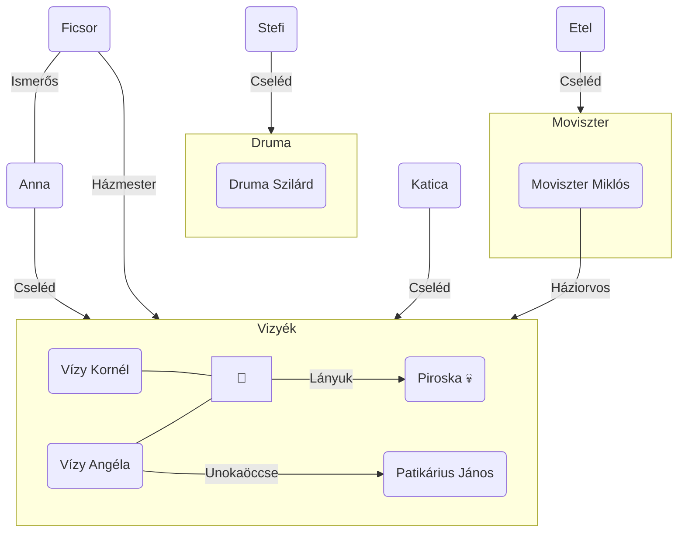

# Idő

Cselekménye „időbeli határon”, 1919-ben játszódik, mely egy sorsfordító idő:
- háború vége
- a történelmi Magyarország feldarabolása
- a proletárdiktatúra és bukása
- spanyolnátha
- Ady halála
- Kosztolányi íróként és magánemberként is megszenvedte a kor megpróbáltatásait.

**A mű ideje:** a cselekmény **1919.július 31**-én, a Tanácsköztársaság bukása, Kun Béla „elrepülésének” napjától **1922 őszéig** mintegy 3 évet ölel fel. A cseléd **9 hónap szolgálat** után öli meg gazdáit (augusztus – május). A gyilkosság időpontja több szempontból is jelentős: Vizyék elérték szociális pályájuk csúcsát, Anna elérkezik tűrőképessége végső határáig.

# Lehetséges olvasatok

**Lélektani regény**: Az örök emberi természetről tesz lehetővé beszédet, pszichoanalitikus értelmezést; és egyben az Úr-szolga viszonyt feltáró példázatos történet.

**(Egzisztenciális regény:** Az emberi lét mélyebb összefüggéseit feltáró, a lét titokzatosságát sugalló; az áttételek dekódolásával: önéletrajzi számvetés.)

# Regénykompozíció

Az 1. és a 20. fejezet **kerettörténet**et képez, a középső (10. Legenda) tematikusan kapcsolja a történetet a kerethez:

- a keretfejezetek az elbeszélés helyzetének ábrázolását
- a közbenső fejezetek a történetet tartalmazzák.

# Szerkezet

- **előkészítés:** a Vizy házaspár bemutatása
- **a bonyodalom kezdete:** Anna megérkezik Vizyékhez
- **fordulat:** Jancsi kalandja Annával
- **a bonyodalom fokozódása:** Anna menekülési kísérlete (Báthory úr); Anna megaláztatásai - a magzat elhajtása, Jancsi flörtje Moviszternével
- **tetőpont:** kettős gyilkosság
- **megoldás:** a tárgyalás, Anna börtönbe kerül (15 évnyi fegyház Márianosztrán)

A művet egy latin nyelvű **mottó** vezeti be, amely a római katolikus **temetési szertartás szövegé**ből idéz. A részlet egyfelől utalhat Vizyék halálára, másfelől egy Annáért mondott könyörgésként is olvasható.

# Anna jelleme

Neve beszélő név. Az Anna oda-visszafele is olvasható, benne van az engedelmesség és a kacérság is. Az Anna név jelentése: kegyelem, könyörület, báj.

19 éves Balatonfőkajáriból származó egyszerű lány. A cselédkönyve alapján római katolikus vallású, kék szemű, szőke hajú. Szorgalmas, tiszta, belső igénye van a munka iránt, engedelmes. Idegenségét a helytől gyakran némaságba burkolja, gyakran más beszél helyette.

A kor tipikus alakja a cseléd, divatos foglalkozássá vált. Egyfajta státusszimbólum a 20-as, 30-as években. Gyakran tragikus a helyzetük, a vidékről felkerülő lány gyakran ki van szolgáltatva a környezetének

# Anna lelki dimenziói

Annát három különböző szociológiai és egyben lelki dimenzióban figyelhetjük meg:
-  **Első gazdái**nál jól érezte magát, nem érezte terhesnek a szolgálatot, a „helyén” volt. Kiélhette anyai ösztöneit.
-  **Vizyék**nél előbb tökéletesen kiszolgálja, majd legyilkolja őket, de nem azért, mert ők az urak. Itt minden iszonyattal tölti el;
-  A **rendőr**t, aki leszidja és letartóztatja, közel érzi magához, benne magához hasonlót lát.

# Párhuzam az úrnő és a cseléd között

| **Vizy Angéla**                                                                                             | **Édes Anna**                                                                                                        |
| ----------------------------------------------------------------------------------------------------------- | -------------------------------------------------------------------------------------------------------------------- |
| **gyermekét** elveszti                                                                                      | **gyermekét** világra sem hozhatja                                                                                   |
| férje elhidegül tőle, mikor gyászában a legnagyobb szüksége lenne rá (elveszítette 6 éves lányát, Piroskát) | elcsábítják, kihasználják és bajában elhagyják (Patikárius Jancsi)                                                   |
| **házassága látszat** **házasság**, férje rendszeresen csalja                                               | **házasságot sem köthet** kiszolgáltatott helyzetében                                                                |
| keserűségében, önzésében **elembertelenedi**k, cselédkínzásban éli ki bánatát                               | sérelmeit munkába fojtja, elfásul, **elgépiesedik**                                                                  |
| szociális felemelkedésük csúcsán (férje előléptetése) **összeomlik**                                        | szenvedései tetőfokán személyisége szétesik, már nem ura önmagának: **gyilkol** (a Holdra vonító kutya jel a tettre) |

# A tragédia bekövetkezésének előzményei

- Amint Anna az új helyre kerül, **megérzi, hogy nem szabad itt maradnia. A molyok ellen használt kámfor** undorítja Annát, s ez jelzi számára, hogy menekülnie kell.
- **Vizyné embertelen**, kíméletlen parancsolgatásai, melyek látszólag egyáltalán nem viselik meg a lányt. Háztartási gépnek, személyiség nélküli eszköznek tekinti.
- Rövid **szerelmi viszony Patikárius Jancsival**, neki adja ártatlanságát.
- Jancsi hidegen elutasítja a lányt.
- Anna megtudja, hogy várandós, ezért Jancsi **magzatelhajtó** szert szerez
- Báthoryval történő **házassági lehetőségét Vizyné megakadályozza.**
- Az estély alkalmával Anna az ajtórésen át látja, hogyan **udvarol Jancsi Moviszter** fiatal és szép **feleségének**.

A műben két alapvető motiváció van: **érdeketika és értéketika** (ezek küzdenek egymással). Az utóbbi kerül ki vesztesen, mivel az érdek mozgatja a világot. A jellemek rendszere erre a konfliktusra épül. Édes Anna fokról fokra veszíti el egyéniségét, ennek következménye a freudizmus alapján a lélektani robbanás: megöli gazdáit.

- **Vizy Kornél:** intézményember, nem szereti a feleségét, máshol pótolja a hiányosságokat, valamint a hivatali rangjához menekül. A minisztériumot misztériumnak hívja, ez az ő temploma. Fontos neki a pénz és a rang. Annával nincs közvetlen kapcsolata, mert nem érdekli az otthona.
- **Vizyné:** egyfajta tulajdonember. Saját korlátait a birtoklás, a parancsolás pótolja. Az otthona a mindene, de mint anya és feleség csődöt mondott. Az otthon és így a cseléd fölötti hatalmában éli ki magát. Az ő temploma az otthon. Annával szoros a kapcsolat, mivel ő uralkodik fölötte. Ő a legfőbb felelős a tragédiáért.
- **Patikárius Jancsi:** az élvezet embere. Egri unokaöcs, típusát Kosztolányi fedezi fel. Tipikus ösztönember, temploma a játékterem, istene a pénz, mivel ezáltal mindent meg lehet vásárolni. Annát elcsábítja, majd eldobja, megalázza a terhes lányt. Közvetlen előidézője a tragédiának.
- **Moviszter Miklós:** idős, öreg orvos, aki erkölcsös, tiszta életre törekszik, Ő az író szócsöve. Egyedül ő szólal fel Anna mellett a tárgyaláson.

# Érdekességek

A regényt a Nyugat közölte július 1-jétől folytatásokban, miután a szerző a szerkesztőknek egy napon reggeltől estig tartó felolvasás során bemutatta;

Megjelenésekor az egyértelmű kritikai és közönség- siker mellett támadások is érték az írót és művét. A jobboldali sajtó az őszirózsás forradalombeli szerepe, a baloldali értelmiség a múlt megtagadása miatt bírálta Kosztolányit; A regény utóélete is viszontagságos, mivel az 1929-es kiadást követő újabb kiadások (’36-, ’43-, ’63-as) szövegromlást okozó csonkításokkal jelentek meg. Ezeknek ideológiai, vagy félreértéseken/értelmezéseken alapuló okai vannak. Veres András az ilyen jellegű csonkításoknál tisztességesebbnek tartja, ha a művet meg sem jelentetik.

Az újságcikk, melyből kipattant az alapötlet:

![[7. Kosztolányi Dezső - Édes Anna.png]]

[Érdekes videó Kosztolányiról](https://www.youtube.com/watch?v=QP_pVY7Ibpw)
[Holnap Témazáró - Édes Anna](https://www.youtube.com/watch?v=RmZS3Rp1AxM)
