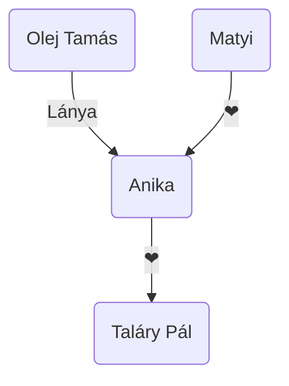

# Élete

Mikszáth Kálmán a palóc földön született 1847-ben Sklabonyán egy művelt családban. Itt végezte el az általános iskolát. Rimaszombaton lévő evangélikus középiskolába járt. Itt írja az első prózai műveit. A középiskolai éveinek második felét pedig a selmecbányai evangélikus gimnáziumban fejezte be. 1866-ban érettségit követően jogi tanulmányokba kezdett Pesten. Viszont tanulmányait felfüggeszti és az írás felé veszi az irányt. 1873-ban feleségül veszi Mauks Ilonát és szerkesztője lesz a Nógrádi lapok című újságnak. A következő évben megjelenik az első könyve. Később elválik feleségétől hűtlenség miatt. 1878-ban Szegedre, a helyi újság a Szegedi napló szerkesztőségéhez kerül. Erőre kap, megjön írói önbizalma, itt sikeres lesz. A későbbiekben visszaköltözik a fővárosba. Itt a Pesti hírlapnál kezdett el dolgozni és sorra jelentek meg alkotásai. 1883-ban újra elveszi feleségét és a Kisfaludy társaság és az akadémia tagja is lesz. 

1890-ben nagy tragédia éri, amikor fia meghal. Élete végéig nem tudja feledni ezt az
emléket. Ezek után is folytatja regény írásait, amelyek hatalmas sikert alkottak.
1904-től idejét már a szülőföldjén tölti, 1910 május 28-án meghal.

# Az a fekete folt (1881)

Ez a tanulságos novella, amelynek elolvasását követően a bonyodalom és a
befejezés is nyitva marad a főszereplő sorsával egyetemben.
A főszereplő a brezinai bacsa, Olej Tamás. A juhász a herceg számadója, a saját
szemszögéből korlátlan. Neki csak Isten parancsol és a herceg. Életében jelentős
szerepet tölt be lánya Anika és a bojtár, Matyi és a juhai. Az emberektől távol élő
bojtárok munkásságát úgy mutatja be, hogy szívünkhöz közel álljanak. A
bonyodalmat az alkotja, hogy a herceg egy vadászat során beleszeret Anikába és
harmadnap egy alkut ad a bacsának a lányáért cserébe. Viszont ez a harmadnapi
alku a lelki válságba teszi őt. Anika megszöktetése erre rátesz még egy lapáttal. A
bonyodalom tetőpontja hosszas vívódás után az, amikor Matyival üzen a hercegnek,
hogy az alku nem valósul meg. Viszont ekkor ez már késő, mivel Anika nincs otthon,
a keréknyomok az árulkodó jelek, hogy megszöktették. Ennek okából Olej Tamás
felgyújtja az akolt és eltűnik az erdőben.

Olej Tamás lelki rajzát úgy írja le Mikszáth, hogy jelen időben kezdi és lassan átvált
múlt időre ezzel a lelki összeomlását bemutatva. Anikáról nem tudunk meg sokat,
csak hogy eleinte mintha Matyiba lenne szerelmes, de mégis elmegy a Herceggel.
Matyi ennek teljes ellentéte, mivel nem veszi jó néven, hogy az általa szeretett Anika
elmegy egy nála gazdagabb nemessel. Ez jeleníti meg a romantikus vonást a
műben. A mű egy dallal kezdődik és záródik is egyben. Ez segít, hogy jobban
belelássunk Olej Tamás létébe. Viszont a bonyodalomban nagyon realistán ábrázolta
világunkat. A válságos képet az alkotja, hogy képes „eladni” a lányát, és még a
felesége temetésén se sír.

A mű felveti bennünk az erkölcsiség kérdését. A végén megérthetjük mekkora
jelentéssel is bír a novella címe, amely a hibáink utáni fekete foltot szimbolizálja
bennünk.

