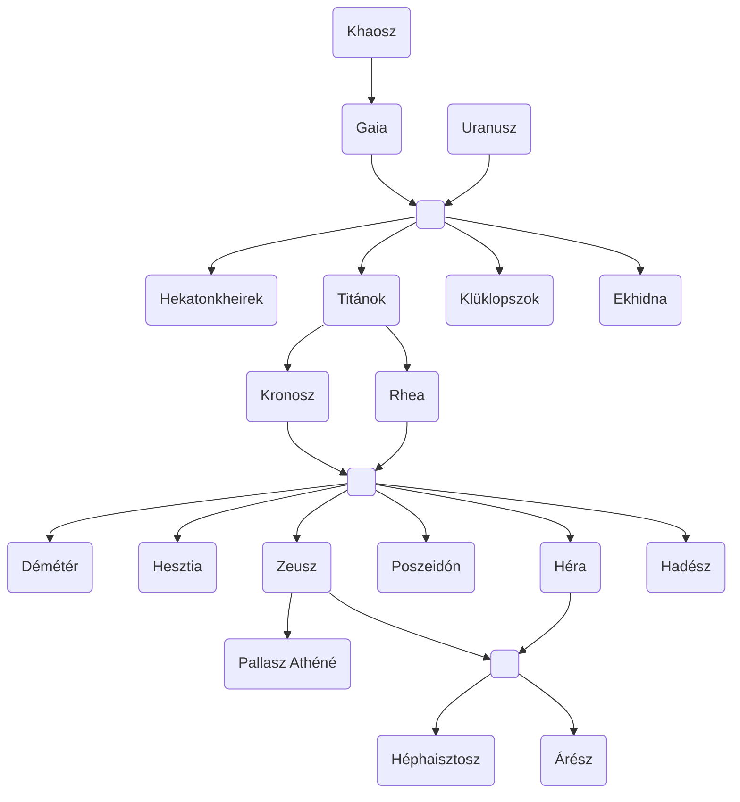

| ISTEN NEVE             |                                                                                 FELADATKÖR | ESZKÖZÖK (Szent növények, állatok) |
| :--------------------- | -----------------------------------------------------------------------------------------: | ------------------------------------: |
| Zeusz(Jupiter)         |                                                         A férfi teremtő erő megtestesítője |                             Sas, bika |
| Héra(Juno)             |  *Zeusz* nővére és szeretője *Héphaisztosz* anyja Házasság, család, szülés istennője |                      Pávatoll, liliom |
| Poszeidón(Neptunusz)   |                                                             *Zeusz* tesója Óceán istene |    Háromágú szigony, ló, bika, delfin |
| Démétér(Ceres)         |                                                                    Gabona éréséért felelős |                Gyümik, disznó, vadkan |
| Apollón(Apollo)        |                        *Artemisz* ikertestvére, igazság, jóslás, fertőző betegségek istene |                           Lant, babér |
| Artemisz(Diana)        |                             Medve istennő, *Zeusz* lánya, tisztaság és a szűziesség istene |     Sarló, íj és nyíl, kutya, szarvas |
| Hadész(Plutó)          |                                                            *Zeusz* testvére Alvilág ura |       3 fejű kutya, nárcisz, cédrusfa |
| Aphrodité(Venus)       | *Héphaisztosz* felesége Tenger habjaiból született Termékenység, szépség és szerelem |                Kagyló, gyöngy, galamb |
| Héphaisztosz(Vulcanus) |                         *Héra* fia *Afrodité* férje Tűz és kavics mesterség Sánta |           Sisak, páncél, dárda, pajzs |
| Árész(Mars)            |                                                       Háború, pusztulás, ijedtség, félelem |                  lándzsa, kard, sisak |
| Hermész(Mercurius)     |                     Istenek követe, tolvajok, írás, lant, utazók, lelkek alvilági vezetője |         Szárnyas csizma, kalap, kakas |
| Dionüszosz(Bacchus)    |                                                                 Bor és mámor, termékenység |                     Szőlő, borospohár |

> [!note] Nincs feltüntetve:
> - Hermész
> - Apollón
> - Artemisz
> - Aphrodité
> - Dionüszosz
> - [Teljes családfa](https://en.wikipedia.org/wiki/Family_tree_of_the_Greek_gods)
