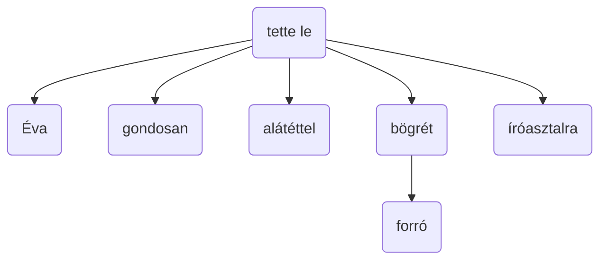
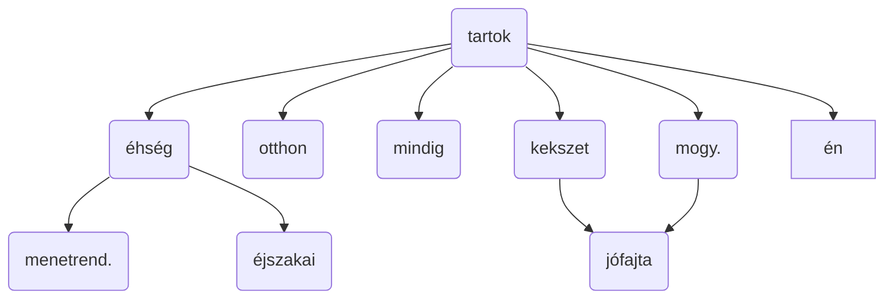

**Szerkezeti szempontból** a beszéd minimális egysége a **mondategység**. Mondategységnek nevezzük az egyszerű mondatokat, az összetett mondatok minden egyes tagmondatát, valamint a tagolatlan és a hiányos szerkezetű mondatokat is.

A mondatot **kommunikációs szempontból** egyetlen **mondategésznek** tekintjük. Az egyszerű mondat egyetlen mondategész, amely egyetlen mondategységből áll. Az összetett mondat is egy mondategész, azonban tovább tagolható szerkezetileg önálló mondategységekre, tagmondatokra.

#### A mondatok szerkezet szerinti osztályozása:
# A mondatok szerkezet szerinti osztályozása

- **Egyszerű mondatok**:
    - **Teljes mondat**:
        - **Tagolt mondat**: alany-állítmányi (predikatív) szerkezetet tartalmaz (funkcionálisan tagolt).
            - **Tőmondat**: csak alanyt és állítmányt tartalmaz.
            - **Bővített mondat**: az állítmányhoz vagy az alanyhoz alárendelt bővítmény kapcsolódik.
        - **Tagolatlan mondat**: az alany és az állítmány nem választható szét benne. Tagolatlan mondatok a megszólítások, az indulatszók, a módosítószók egy része.
    - **Hiányos mondat**: a mondatból az alany vagy az állítmány, esetenként akár mind a kettő hiányzik. Az alany hiányának esetén csak a harmadik személyű alanyt nem tartalmazó mondat számít hiányos mondatnak. Hiányos a mondat akkor is, ha a tárgyas ragozású ige mellől a tárgy, vagy a vonzatos igék mellől a kötelező vonzat hiányzik.
- **Összetett mondatok**:
    - **Mellérendelő** összetett mondatok: a mondategységek (tagmondatok) között csak tartalmi-logikai kapcsolat van, és így minden tagmondatuk szerkezetileg önálló.
		- kapcsolatos (és)
		- ellentétes (de, viszont)
		- választó (vagy)
		- magyarázó
		- következtető
    - **Alárendelő** összetett mondatok: a mondategységei, vagyis a tagmondatai között nyelvtani kapcsolat is van.

Többszörösen összetett mondatokban keveredhet az alá- és mellérendelő viszony. A közlés szempontjából a többszörösen összetett mondat is egyetlen mondategész, amely több mondategységre bomlik. Ezek a mondategységek tömbösödhetnek. Külön tömböt jelent minden főmondat a saját alárendelt mondataival.

> [!HELP] Source: [www.nyelvora.com](https://www.nyelvora.com/magyar-nyelvtan/5-2-a-mondatok-szerkezete.html)

# Példák

> [!NOTE] Az ágrajzban nem a betűjelek vannak, hanem a szavak, de feladatban betűjelek kellenek!
> Ha betűket írtam volna nem lett volna egyértelmű melyik szó kerül oda.

Éva gondosan, alátéttel tette le a forró bögrét az íróasztalra.

A menetrendszerű éjszakai éhség ellen tartok (én) otthon mindig jófajta kekszet és mogyorókrémet.

> [!NOTE] A "kekszet" és "mogyorókrémet" mellérendelik egymást, ezt nem tudtam illusztrálni

A régi postásunk ma új biciklivel járt az utcánkban a levelek kézbesítése miatt.

> [!INFO] Nem lesz többszörösen összetett mondat
