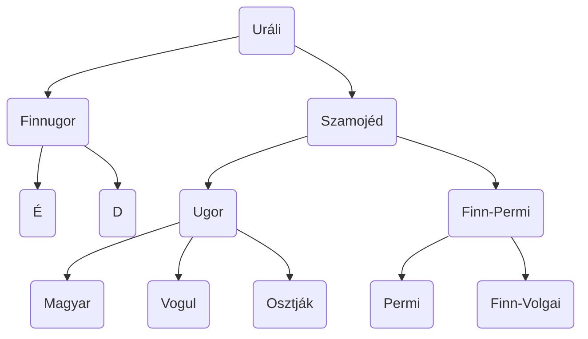

[NKP](https://www.nkp.hu/tankonyv/magyar_nyelv_11_nat2020/lecke_02_008)

# A korszakai

| Korszak                       | Időszak                  | Jellemzők                                                                                                        |
| ----------------------------- | ------------------------ | ---------------------------------------------------------------------------------------------------------------- |
| Az Urál vidéki őshaza korszak | 5. sz. közepéig          | - ősmagyar nyelv                                                                                                 |
| Vándorlások kora              | 895-ig (Honfoglalás)     | - lovasnomád törzsek → más népektől új szavak                                                                    |
| Ómagyar korszak               | 1526-ig (Mohács)         | - mai hangrendszer - letelepedés → nyelvjárások                                                               |
| Középmagyar korszak           | 1772-ig (felvilágosodás) | - írott köznyelv kialakulása - reformáció + humanizmus + könyvnyomtatás hatásai - “dzs” - magázás       |
| Újmagyar korszak              | 1920-ig (Trianon)        | - nyelvújítási mozgalmak - írott és beszélt nyelvi standard kialakulása                                       |
| Újabb magyar korszak          | napjainkig               | - magyarság ⅓-a kisebbségbe került - nyelvi egységesítési törekvések - technológia és globalizáció hatásai |

### Ősmagyar

- ugor nyelvcsaládból szétválás
- nem maradtak meg nyelvemlékek
- nyelvtani rendszer kialakulása
	- új képzők: -ság, -ség, -hat, -het
	- többes szám jele: -k
	- állandósultak a névutók (után, előtt, alatt)
	- tárgyrag: -t
	- igei személyragok (csinálhat==ja==, csinálhat==om==)
	- befejezett múlt (-t, -tt, volt) (már kikopott)
	- összetett igeidők
	- új magánhangzók: é
	- új mássalhangzók: b, g
	- mondat: főnév + ige + bővítmény

### Ómagyar

- szláv és latin jövevényszavak
- korábbi törzsi nyelvjárásból területi nyelvjárások (dialektusok) lettek
- korszak második fele: kódexek kora
- mai hangrendszerek (kivéve: dzs)
- a tővéghangzó egyre zártabb lett, a kor elején el is tűnt
	- (kuta —> kuto —> kutu —> kút)
- többalapú tövek kialakulása, viszonyszók rendszere, névelők, többszörösen összetett és mellérendelő mondatok, képzőbokrok keletkeznek (???: d, g; műveltető: t)

### Középmagyar

- helyesírás megszületése
- írott nyelvbe bekerülnek a nyelvjárások szavai
	- hangutánzók, szóképzés, szóösszetételek, jelentésváltozások által
- 16\. század: magázás
- nyelvtani szerkezet: igeidők használata, igekötőrendszer fejlesztése, tárgyas igeragozás, határozói igenevek (-va, -ve, -ván, -vén), névutóállomány növekedése

### Újmagyar

- felvilágosodás mozgalma: tudományok és művészetek terjesztése
	—> nyelvújítási mozgalom
	- cél: alkalmassá tenni a magyar nyelvet arra, hogy az államigazgatásban és a tudományokban is használni lehessen
- szépirodalmi nyelv csiszolása, nyelvápolás
- a reformkor végére kialakult egy egységes nyelvváltozat, a beszéd és írott nyelvi  standard
- szótárak, nyelvtankönyvek, helyesírási szótáraszabályzatok
- nyelvújítás: nyelvjárási szavak forgalomba hozatala, régi / elavult szavak felevenítése, tulajdonnevek közszóvá, szóképzés, elvonás, szóösszetétel, szóösszerántás
	—> [[5. A nyelvújítás lényege és jelentősége példák alapján]]
- nyelvtani szerkezet fejlődése: múltidő rendszere, tárgyas igeragozás, ikes igeragozás, szenvedő igeragozás, ismétlődő, toldalékok, névutóállomány növekedése

# Az uráli nyelvcsalád

> [!CHECK] Source: füzet

> [!HELP] Ezek már bruh

- finnugor ága
- nyelvészeti eszközökkel minden kétség nélkül megállapítható
- az ősmagyarok hazája Európában, az Urál déli részétől nyugatra, a Volga és a Káma folyók vidékén lehetett
- népei:
	- önálló államként: legnépesebb: magyarság (~13 millió), észtek, finnek
	- orosz, norvég, lett, svéd kisebbségekben
- egy közös alapnyelv
- legközelebbi rokonok:
	- Hanti-Manysiföld (főváros: Hanti-Manyszijk)
	- Magyarországnál 5-6x nagyobb terület
	- 40000 lakos
	- hagyományos, rénszarvas tenyésztő életmód

### Nyelvrokonság kutatásának története

- 18. sz. második fele:
	- Sajnovics János: Lappföldre utazott, számi nyelv tanulmányozása
	- Gyarmathy Sámuel: 1799-ben bizonyította a finnugor nyelvrokonságot
- 19. sz.: anyagok gyűjtése
	- Reguly Antal: Finnországban és Oroszországban
	- Hunfalvy Pál & Budenz József: gyűjtött anyagok feldolgozása
		↳ német származású, megtanult magyarul
		↳ bebizonyította a finnugor-elméletet
	- Vámbéry Ármin: török rokonság bizonyítása
- 1937: Zsirai Miklós: Finnugor rokonságunk című műve

### Nyelvrokonság kutatásainak módszerei

- nyelvek állandó változása → a rokonság nem szembetűnő
- két nyelvben a szavak & nyelvtani rendszerek hasonlóságának több oka is lehet
	- véletlen (das Haus ~ ház)
	- a vizsgált szó jövevényszó (Schwager~sógor)
- összehasonlító nyelvtudomány: rendszerszerű eltérések és hasonlóságok vizsgálata
	- alapszókincset vizsgálja
	- nyelvtípusokba sorolás
- **nyelvtípusok**:
	- elszigetelő ~ izoláló → különálló szóelemek
	- ragasztó ~ agglutináló → toldalékok
	- hajlító ~ flektáló → morfémák belső szerkezete is változik
	- bekebelező ~ inkorporáló → szélsőséges ragozás

az angolban pl a szemüveg többesszámban van: sunglasses

### Nyelvrokonság bizonyítékai

- alapszókészlet vizsgálata
	- egykori közösség számára legfontosabb szavak
	- testrészek, alapigék, vadon élő állatok, növények, természeti nevek, rokonsági megnevezések, halászattal/vadászattal/gyűjtögetéssel kapcsolatos szavak, felszerelések, melléknevek, névmások, számnevek
	- ősi alapszókészlet: kb. 700-1000 szó
- nyelvtani viszonyító elemek
	- toldalékok

##### 1. Hangtani bizonyítékok
###### a, Szabályos hangmegfelelések

- sok változás → nem feltétlen ugyanazt a hangot keresik → rendszerszerű hasonlóságok, hangmegfelelések keresése
	- a hang ugyanaz marad
	- a hang megváltozik, de mindenhol ugyanaz lesz belőle
	- a hang szabályosan megváltozik, attól függően, hogy milyen hangok veszik körül más hanggá
	- az egyik nyelvből egy bizonyos hang a másik rendszerszerűen hiányzik

###### b, Magánhangzó-harmónia

- mély vagy magas hangrend, a toldalékok hangnemben illeszkednek a szótőhöz

###### c, Szóhangsúly

- finnugor nyelveknél többnyire az első hangsúlyon

##### 2. Alaktani bizonyítékok

- agglutináció
- ősi toldalékok
- személyes névmások
- irányhármasság (hol-honnan-hová)
- alanyi és tárgyas ragozás

##### 3. Mondattani bizonyítékok

- szabad, kommunikatív szórend (↔indoeurópai nyelvek)
- nincs egyeztetés: a jelzett szó és a jelző között/számnév után a főnevek egyes számban/páros testrészek egyes számban
- birtoklás kifejezése létigével
- megengedett a csupán névszóval kifejezett állítmány

> [!ERROR] Source: ?
