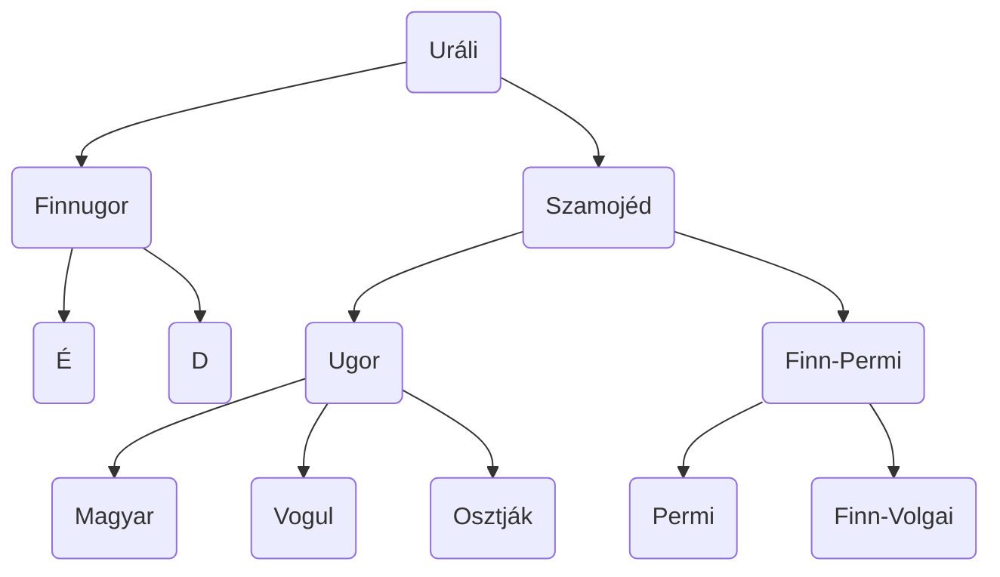

[NKP](https://www.nkp.hu/tankonyv/magyar_nyelv_11_nat2020/lecke_02_008)

# A korszakai

| Korszak                               | Időszak                  | Jellemzők                                                                                                        |
| ------------------------------------- | ------------------------ | ---------------------------------------------------------------------------------------------------------------- |
| Az Urál vidéki őshaza korszaka        | 5. sz. közepéig          | - ősmagyar nyelv                                                                                                 |
| Vándorlások kora                      | 895-ig (Honfoglalás)     | - lovasnomád törzsek → más népektől új szavak                                                                    |
| [[#Ómagyar\|Ómagyar korszak]]         | 1526-ig (Mohács)         | - mai hangrendszer - letelepedés → nyelvjárások                                                               |
| [[#Középmagyar\|Középmagyar korszak]] | 1772-ig (felvilágosodás) | - írott köznyelv kialakulása - reformáció + humanizmus + könyvnyomtatás hatásai - “dzs” - magázás       |
| [[#Újmagyar\|Újmagyar korszak]]       | 1920-ig (Trianon)        | - nyelvújítási mozgalmak - írott és beszélt nyelvi standard kialakulása                                       |
| Újabb magyar korszak                  | napjainkig               | - magyarság ⅓-a kisebbségbe került - nyelvi egységesítési törekvések - technológia és globalizáció hatásai |

### Ősmagyar

- ugor nyelvcsaládból szétválás
- nem maradtak meg nyelvemlékek
- nyelvtani rendszer kialakulása
	- új képzők: -ság, -ség, -hat, -het
	- többes szám jele: -k
	- állandósultak a névutók (után, előtt, alatt)
	- tárgyrag: -t
	- igei személyragok (csinálhat==ja==, csinálhat==om==)
	- befejezett múlt (-t, -tt, volt) (már kikopott)
	- összetett igeidők
	- új magánhangzók: é
	- új mássalhangzók: b, g
	- mondat: főnév + ige + bővítmény

### Ómagyar

- szláv és latin jövevényszavak
- korábbi törzsi nyelvjárásból területi nyelvjárások (dialektusok) lettek
- korszak második fele: kódexek kora
- mai hangrendszerek (kivéve: dzs)
- a tővéghangzó egyre zártabb lett, a kor elején el is tűnt
	- (kuta —> kuto —> kutu —> kút)
- többalapú tövek kialakulása, viszonyszók rendszere, névelők, többszörösen összetett és mellérendelő mondatok, képzőbokrok keletkeznek (???: d, g; műveltető: t)

### Középmagyar

- helyesírás megszületése
- írott nyelvbe bekerülnek a nyelvjárások szavai
	- hangutánzók, szóképzés, szóösszetételek, jelentésváltozások által
- 16\. század: magázás
- nyelvtani szerkezet: igeidők használata, igekötőrendszer fejlesztése, tárgyas igeragozás, határozói igenevek (-va, -ve, -ván, -vén), névutóállomány növekedése

### Újmagyar

- felvilágosodás mozgalma: tudományok és művészetek terjesztése
	—> nyelvújítási mozgalom
	- cél: alkalmassá tenni a magyar nyelvet arra, hogy az államigazgatásban és a tudományokban is használni lehessen
- szépirodalmi nyelv csiszolása, nyelvápolás
- a reformkor végére kialakult egy egységes nyelvváltozat, a beszéd és írott nyelvi  standard
- szótárak, nyelvtankönyvek, helyesírási szótáraszabályzatok
- nyelvújítás: nyelvjárási szavak forgalomba hozatala, régi / elavult szavak felelevenítése, tulajdonnevek közszóvá, szóképzés, elvonás, szóösszetétel, szóösszerántás
	—> [[5. A nyelvújítás lényege és jelentősége példák alapján|Nyelvújítás]]
- nyelvtani szerkezet fejlődése: múltidő rendszere, tárgyas igeragozás, ikes igeragozás, szenvedő igeragozás, ismétlődő, toldalékok, névutóállomány növekedése

# Az uráli nyelvcsalád

> [!CHECK] Source: füzet
